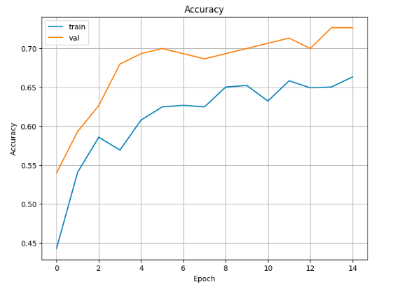
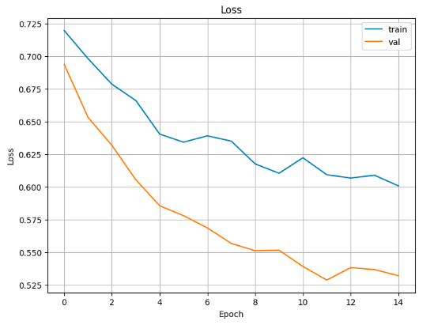
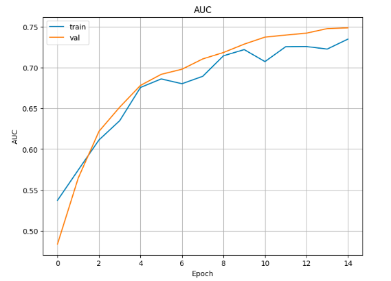
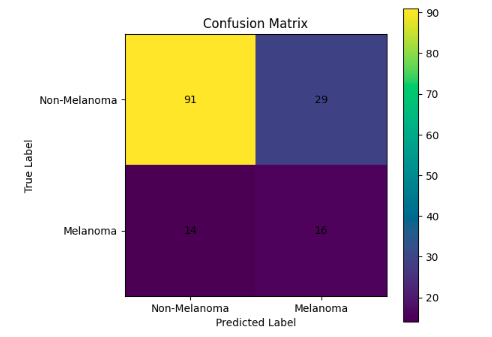
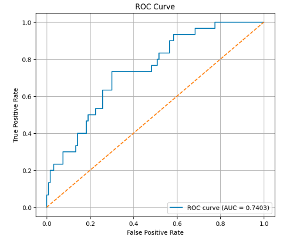

# Melanoma Skin Cancer Detection Using Convolutional Neural Networks

## Team Member

- **Tanha Kabir Koly**

Course: CAP5638 / Pattern Recognition  
Semester: Spring 2026  
Instructor: Dr. Yushun Dong  
Department of Computer Science, Florida State University  

---

## Project Overview

This project presents a comparative deep learning study for binary classification of **melanoma** and **non-melanoma** skin lesions using dermoscopic images.

Melanoma is one of the most serious types of skin cancer, and early detection is important for improving patient outcomes. In this project, several convolutional neural network-based approaches were implemented and compared to evaluate their effectiveness in classifying skin lesion images.

The project includes the following experiments:

1. **Basic CNN baseline model**
2. **Transfer learning using EfficientNetB0**
3. **EfficientNetB0 with fine-tuning, focal loss, and threshold tuning**
4. **EfficientNetB0 with oversampling and fine-tuning**

The goal was to improve classification performance by addressing challenges such as class imbalance, limited training data, and model generalization.

---

## Dataset

### Primary Dataset Used

This project uses the **ISIC 2017 Challenge Dataset** for skin lesion analysis.

Official dataset links:

- ISIC 2017 Challenge main page:  
  https://challenge.isic-archive.com/landing/2017/

- ISIC Challenge datasets page:  
  https://challenge.isic-archive.com/data/

- ISIC 2017 Task 3: Lesion Classification:  
  https://challenge.isic-archive.com/landing/2017/44/

### Files Used in This Project

The code expects the following folders and CSV files:

```text
training/
validation/
ISIC-2017_Training_Part3_GroundTruth.csv
ISIC-2017_Validation_Part3_GroundTruth.csv
```
## Visual Results

Important result images from the model evaluation are shown below.

### Accuracy Curve



### Loss Curve



### AUC Curve



### Confusion Matrix



### ROC Curve




---

## Requirements

This project was developed using **Python 3.x** and **Google Colab**.

Required Python libraries:

```text
tensorflow
numpy
pandas
matplotlib
scikit-learn

You can install the required packages using:
pip install tensorflow numpy pandas matplotlib scikit-learn
```

---

## How to Run the Project
Running in Google Colab
1.Open Google Colab.
2.Upload one of the notebook files:
```text
melanoma_detection_basic_cnn.ipynb
Melanoma_Detection_Efficient_Net.ipynb
Melanoma_Detection_EfficientNet_FineTuning_focal_loss.ipynb
Melanoma_Detection_EfficientNet_Oversampling_FineTuning.ipynb
```

---

## Mount Google drive
```text
from google.colab import drive
drive.mount('/content/drive')
```

---

## Download the ISIC 2017 dataset from the official links and place the required files in your Google Drive using this structure:
```text
project_folder/
├── training/
├── validation/
├── ISIC-2017_Training_Part3_GroundTruth.csv
└── ISIC-2017_Validation_Part3_GroundTruth.csv
```


---

## Update the dataset paths in the notebook so they match your Google Drive location.
```text
train_dir = "/content/drive/MyDrive/project_folder/training"
val_dir = "/content/drive/MyDrive/project_folder/validation"

train_csv = "/content/drive/MyDrive/project_folder/ISIC-2017_Training_Part3_GroundTruth.csv"
val_csv = "/content/drive/MyDrive/project_folder/ISIC-2017_Validation_Part3_GroundTruth.csv"
```


---

## Run all cells sequentially.
```text

```
---

## Summary
```text
This project demonstrates how convolutional neural networks and transfer learning can be used for melanoma skin cancer detection from dermoscopic images. The study compares a basic CNN model with EfficientNetB0-based transfer learning and fine-tuning approaches.

Additional techniques such as focal loss, oversampling, and threshold tuning were used to improve performance under class imbalance.
```
